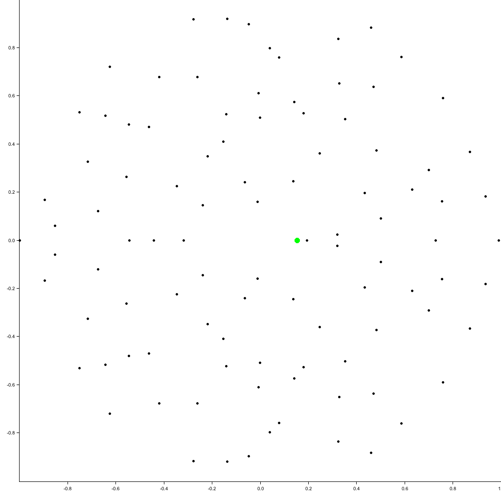

# Random matrix eigenvalue toy

## What is this about?

Based on https://twitter.com/sigfpe/status/984889330467352576, I
learnt about https://en.wikipedia.org/wiki/Circular_law, which seems
pretty cool. I wanted to play about with it myself, and perhaps
understand the way in which the points kind of repel each other.

It's also a nice excuse to do a little more Rust and some
computational linear algebra (aka use the `nalgebra` library).

So, I've done this, and have generated a nice little animated gif of a
new eigenvector being linearly interpolated in (if you see what I
mean), and you can see all the other eigenvectors moving around it.

## Getting started

```
cargo +nightly run eigenvalues
```

The colour scheme may not work for you due to the way the "gif" crate
handles palette building (https://github.com/38/plotters/issues/273).
I've locally hacked `plotters-bitmap` to set the `speed` of
`from_rgb_speed` to 1 in order to work around this.

## Just show me the picture!

Oh, alright, then. Here's the animation I generated:



## In more detail

I first tried producing an animation of what happens as you increase
the size of the matrix, adding more eigenvalues (more specifically, it
plotted the eigenvalues as I took n x n sub-matrices of the full-sized
matrix). This just produced a pattern of eigenvalues bobbling about a
bit, and gave no real insight.

I then tried interpolating between a matrix where the last eigenvector
is orthogonal to all the others (forced by having the last dimension
of matrix be diagonal-element only) and the full random matrix. This
should effectively move between the eigenvalues of the n-1 x n-1
matrix and the eigenvalues of the n x n matrix, so you can see the
other eigenvalues adjust to deal with the new eigenvalue. The mean and
variance will also slightly change, which I've not accounted for, but
at high dimension I hope the effect is minor.

To make it easier to interpret, I've highlighted the newly-added
eigenvalue. You can see the other eigenvalues move around it. This
seems pretty neat!

This also includes the bit where you can see eigenvalues switching
between conjugate pairs of complex numbers (Im != 0) and pairs of
reals.

## Did you learn anything?

Playing about with both `nalgebra` and `plotters` was pleasantly easy.
I felt I could hack things up with them nicely and quickly, and at the
end of it have something I'd trust rather more in production than the
standard Python stacks. Not that this is production code. :)

Finding a bug in the gif generation (that came down to inappropriate
assumptions in the `gif` crate) was a bit disappointing.

It still took longer to do than I expected. Wall-time-wise, this has
taken ages because I've got other stuff going on I can't ignore, but
in terms of actual coding time, the fiddly corners of playing with
numerical stuff always surprises me.

Did I actually learn anything about eigenvalues of random matrices?
The animation is pretty, and I can see stuff going on; I see that not
all the points move far away, but on the whole they even out. I see
the points move in friendly curves as we interpolate the matrix
elements in, with funky little collisions on the real axis. Does it
give me anything like a deep insight? Not really. I'm not sure I
expected it to, but it's been a fun project!
